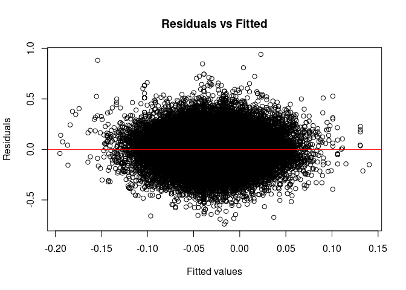
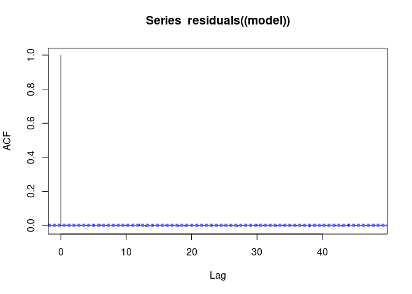
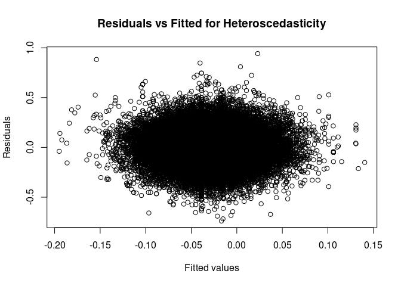
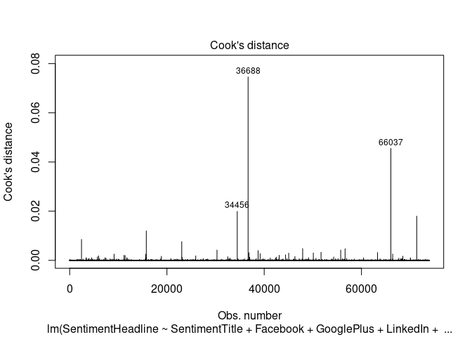
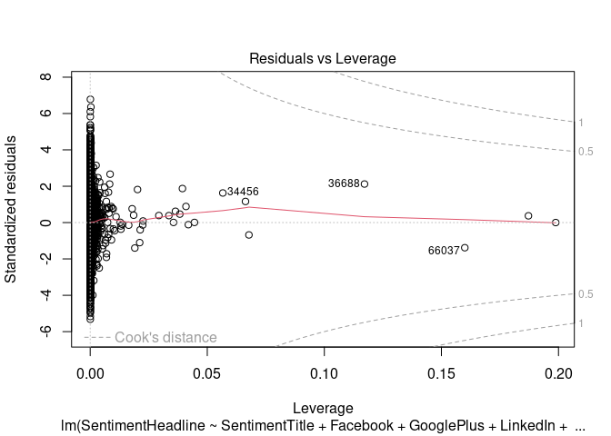

Linear Regression Mini-competition Group 1
================

### Libraries

### Load Data

``` r
News <- read.csv("~/STA 631/Activity/activity04-mini-competition/competition-files/news.csv")
summary(News)
```

    ##      IDLink          Title             Headline            Source         
    ##  Min.   :     1   Length:92431       Length:92431       Length:92431      
    ##  1st Qu.: 24550   Class :character   Class :character   Class :character  
    ##  Median : 52449   Mode  :character   Mode  :character   Mode  :character  
    ##  Mean   : 51807                                                           
    ##  3rd Qu.: 76784                                                           
    ##  Max.   :104802                                                           
    ##     Topic           PublishDate        SentimentTitle      SentimentHeadline 
    ##  Length:92431       Length:92431       Min.   :-0.950694   Min.   :-0.75543  
    ##  Class :character   Class :character   1st Qu.:-0.079025   1st Qu.:-0.11457  
    ##  Mode  :character   Mode  :character   Median : 0.000000   Median :-0.02606  
    ##                                        Mean   :-0.005415   Mean   :-0.02750  
    ##                                        3rd Qu.: 0.064385   3rd Qu.: 0.05965  
    ##                                        Max.   : 0.962354   Max.   : 0.96465  
    ##     Facebook         GooglePlus          LinkedIn       
    ##  Min.   :   -1.0   Min.   :  -1.000   Min.   :   -1.00  
    ##  1st Qu.:    0.0   1st Qu.:   0.000   1st Qu.:    0.00  
    ##  Median :    5.0   Median :   0.000   Median :    0.00  
    ##  Mean   :  114.1   Mean   :   3.928   Mean   :   16.69  
    ##  3rd Qu.:   34.0   3rd Qu.:   2.000   3rd Qu.:    4.00  
    ##  Max.   :49211.0   Max.   :1267.000   Max.   :20341.00

### Test and Train Data after Splitting

``` r
news_train <- read.csv("~/STA 631/Activity/activity04-mini-competition/competition-files/news_train.csv") 
news_test <-  read.csv("~/STA 631/Activity/activity04-mini-competition/competition-files/news_test.csv")
```

### Build a Linear Model

``` r
model <- lm(SentimentHeadline ~ SentimentTitle + Facebook + GooglePlus + LinkedIn + Topic, data = news_train)
summary(model)
```

    ## 
    ## Call:
    ## lm(formula = SentimentHeadline ~ SentimentTitle + Facebook + 
    ##     GooglePlus + LinkedIn + Topic, data = news_train)
    ## 
    ## Residuals:
    ##      Min       1Q   Median       3Q      Max 
    ## -0.73864 -0.08560  0.00257  0.08598  0.94173 
    ## 
    ## Coefficients:
    ##                  Estimate Std. Error t value Pr(>|t|)    
    ## (Intercept)    -3.879e-02  8.493e-04 -45.675   <2e-16 ***
    ## SentimentTitle  1.863e-01  3.745e-03  49.734   <2e-16 ***
    ## Facebook       -1.349e-06  9.660e-07  -1.397    0.163    
    ## GooglePlus     -1.491e-05  3.306e-05  -0.451    0.652    
    ## LinkedIn        3.933e-06  3.181e-06   1.236    0.216    
    ## Topicmicrosoft  2.377e-02  1.360e-03  17.476   <2e-16 ***
    ## Topicobama      2.144e-02  1.267e-03  16.929   <2e-16 ***
    ## Topicpalestine -2.885e-03  1.871e-03  -1.542    0.123    
    ## ---
    ## Signif. codes:  0 '***' 0.001 '**' 0.01 '*' 0.05 '.' 0.1 ' ' 1
    ## 
    ## Residual standard error: 0.1389 on 73936 degrees of freedom
    ## Multiple R-squared:  0.04027,    Adjusted R-squared:  0.04018 
    ## F-statistic: 443.2 on 7 and 73936 DF,  p-value: < 2.2e-16

### Non-linearity of the Data

``` r
plot(residuals(model) ~ fitted(model), main="Residuals vs Fitted", xlab="Fitted values", ylab="Residuals")
abline(h=0, col="red")
```

<!-- -->

### Correlation of Error Terms (Residuals):

``` r
acf(residuals((model)))
```

<!-- -->

``` r
durbinWatsonTest(model)
```

    ##  lag Autocorrelation D-W Statistic p-value
    ##    1     0.002245619      1.995487   0.524
    ##  Alternative hypothesis: rho != 0

### Non-constant Variance of Error Terms (Heteroscedasticity):

``` r
plot(residuals(model) ~ fitted(model), main="Residuals vs Fitted for Heteroscedasticity", xlab="Fitted values", ylab="Residuals")
```

<!-- -->

### Outliers: To identify outliers, we use Cook’s distance plots.

``` r
plot(model, which = 4)
```

<!-- -->

### Outliers: To identify outliers, we use Cook’s distance plots.

``` r
plot(model, which = 4)
```

<!-- -->

### High Leverage Points:Using Leverage Statistic

``` r
plot(model, which = 5)
```

<!-- -->

\#Collinearity:Using Variance Inflation Factor (VIF)

``` r
vif(model)
```

    ##                    GVIF Df GVIF^(1/(2*Df))
    ## SentimentTitle 1.003079  1        1.001538
    ## Facebook       1.422718  1        1.192777
    ## GooglePlus     1.507001  1        1.227600
    ## LinkedIn       1.099393  1        1.048520
    ## Topic          1.046166  3        1.007550
